[return to index](https://released.github.io/)

# FAQ (IDE-KEIL)

* [Necessary driver install](#common_driver)

* [Entry debug mode](#entry_debug_mode)

* [Watch Window](#watch_window)

---

# Make sure driver installed is latest

* __step 1 : install necessary driver__

Nu-Link_Keil_Driver  , driver for KEILC (為了要讓KEILC 知道 , 目前要支援哪些新唐MCU list的driver)
https://www.nuvoton.com/resource-download.jsp?tp_GUID=SW1120200221180521

ICP_Programming_Tool  (PC GUI , programming with NULINK)
https://www.nuvoton.com/resource-download.jsp?tp_GUID=SW1720200221181328

NuTool-PinConfigure (PC GUI , arrange MCU PIN define )
https://www.nuvoton.com/resource-download.jsp?tp_GUID=SW1320200319135912

NuMicro_ISP_Programming_Tool (PC GUI programming tool ,  without NULINK , programming by MCU interfae : USB , UART etc)
https://www.nuvoton.com/resource-download.jsp?tp_GUID=SW1720201209134839

* __step 2 : some other useful link for user manual , driver__ 

[user manual] Nu-Link_Keil_Driver (cortex-M)
https://www.nuvoton.com/resource-download.jsp?tp_GUID=UG1320220111160454

[user manual] Nu-Link_Keil_Driver (8051)
https://www.nuvoton.com/resource-download.jsp?tp_GUID=UG1320220111160909

Nu-Link_IAR_Driver  , driver for IAR
https://www.nuvoton.com/resource-download.jsp?tp_GUID=SW1120200221180914

[user manual] Nu-Link_IAR_Driver (cortex-M)
https://www.nuvoton.com/resource-download.jsp?tp_GUID=UG1320220111161317

[user manual] Nu-Link_IAR_Driver (8051)
https://www.nuvoton.com/resource-download.jsp?tp_GUID=UG1320211228183307

[user manual] ICP_Programming_Tool 
C:\Program Files (x86)\Nuvoton Tools\ICPTool\Nuvoton NuMicro ICP Programmer User Guide.pdf

[user manual] NuTool-PinConfigure
https://www.nuvoton.com/resource-download.jsp?tp_GUID=UG1320220401093634

[user manual] NuMicro_ISP_Programming_Tool (解壓縮開資料夾底下)
NuMicro_ISP_Programming_Tool\User Manual\UM_ISP_Programming_Tool_Rev*.**.pdf

[back to top](#article_top)   

---

# How to entry debug mode in KEIL

* __step 1 : check KEIL option setting__ 

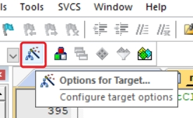

- Option for Target > Output > Select , 
    - Debug Information
    - Create HEX File
    - Browse Information

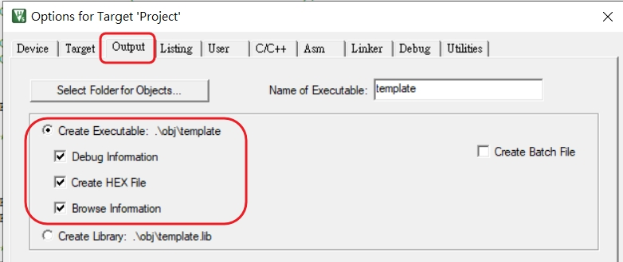

- Option for Target > Debug > Select ,
    - Nuvoton Nu-Link Debugger

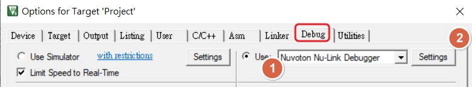

- Option for Target > Debug > Select , 
    - Settings
    - Update Nu-Link firmware , if the Nu-Link firmware version not same as KEIL driver 

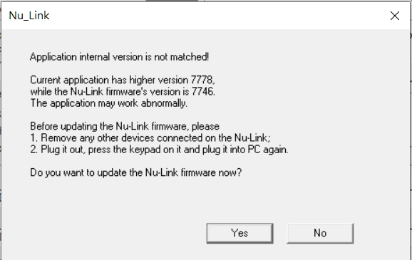

make sure 

- MCU Series selection is correct

- Reset Options > Connect > Select , 
    - ==Connect : Under Reset==
    - purpose : KEIL will be able to reset MCU with nRESET pin __before__ entry debug mode

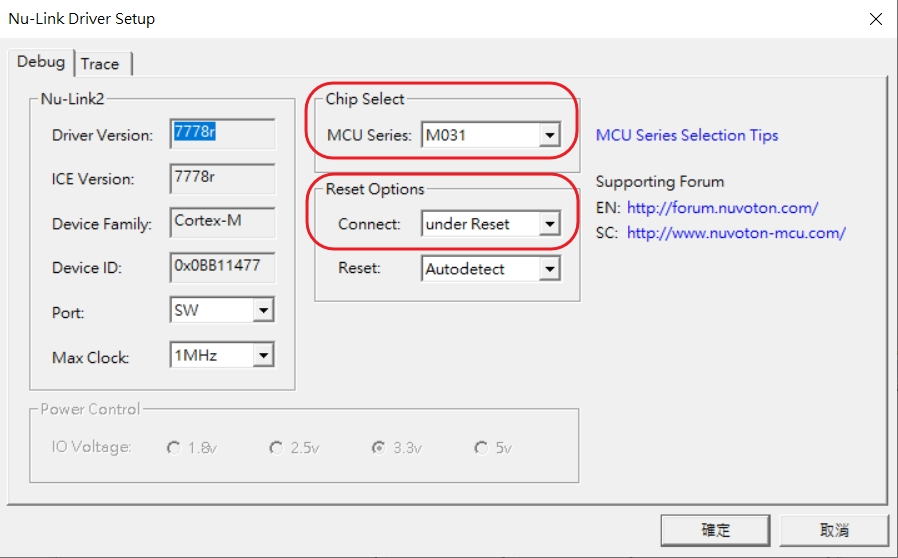

- Option for Target > Utilities > Select ,
    - Use Debug Driver

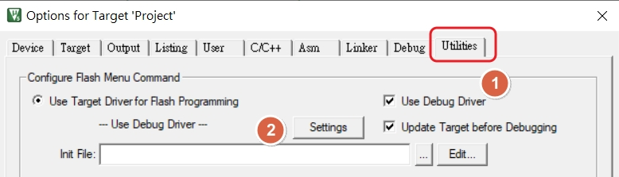

- Option for Target > Utilities > Select , 
    - Settings

make sure 

- Download Function > Select ,  
    - ==Reset and Run==
    - KEIL will be able to reset MCU __after__ update MCU firmware 

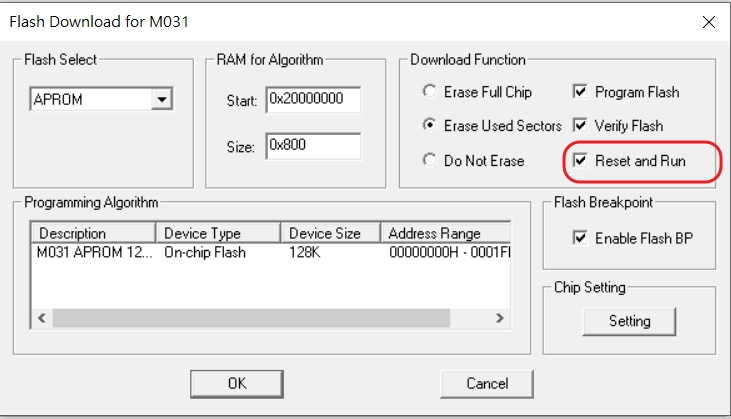

* __step 2 : make sure project is compiled successfully__

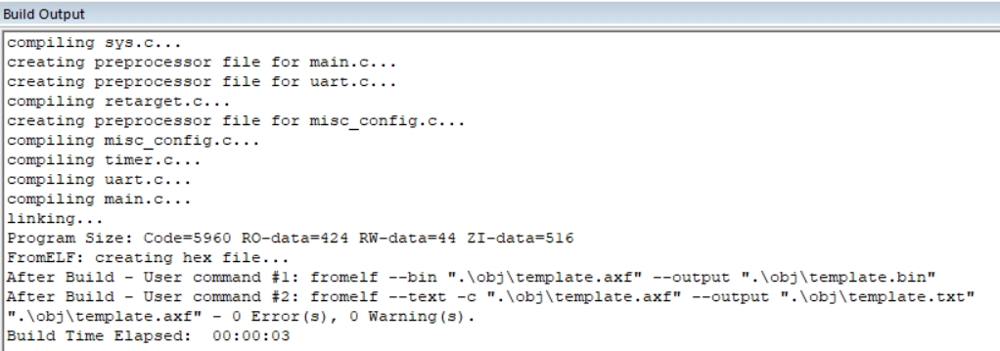

* __step 3 : entry debug mode__

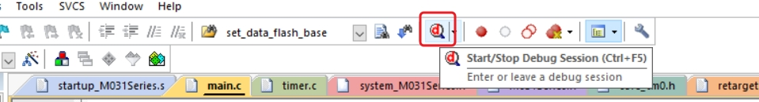

* __step 4 : will stop at main__

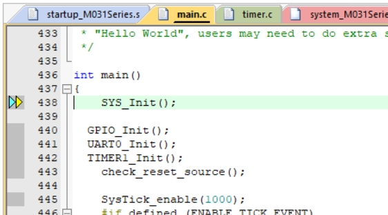

* __step 5 : some debug mode function__

- press Run , to start code process

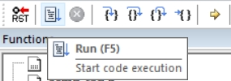

- press Reset , to reset MCU to main code

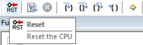

- trace code , by Step in or Step Over

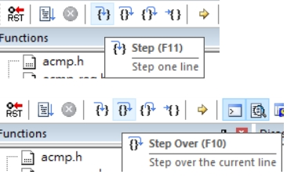

* __step 6 : How to jump to function prototype__

- Right click function name and select , 
    - Go To Definition Of xxx 

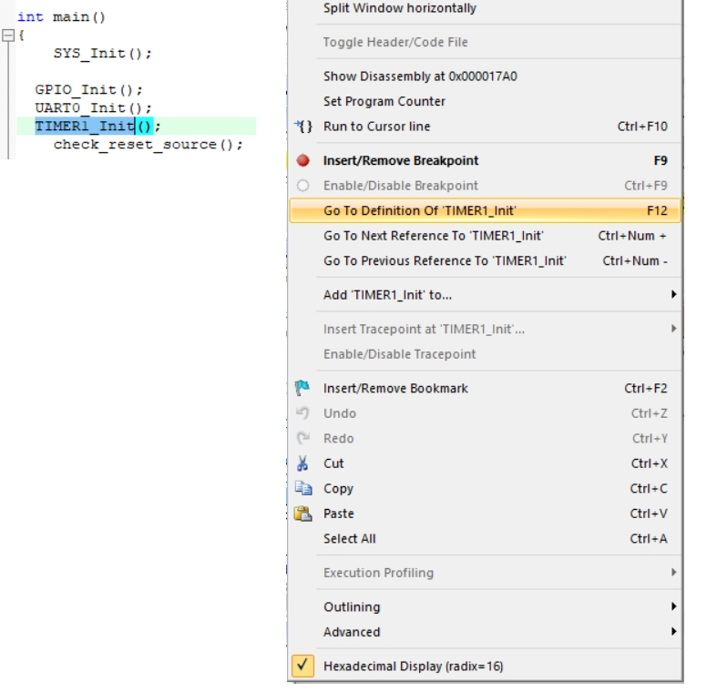

[back to top](#article_top)   

---

# How to monitor variables/structure in watch window

* __step 1 : check KEIL setting__ 

- View > Select

    - Periodic Window Update

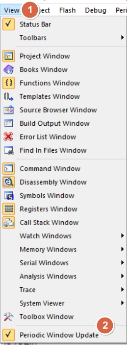

* __step 2 : select variable/structure and right click__

- Add the desired variable/structure into watch window

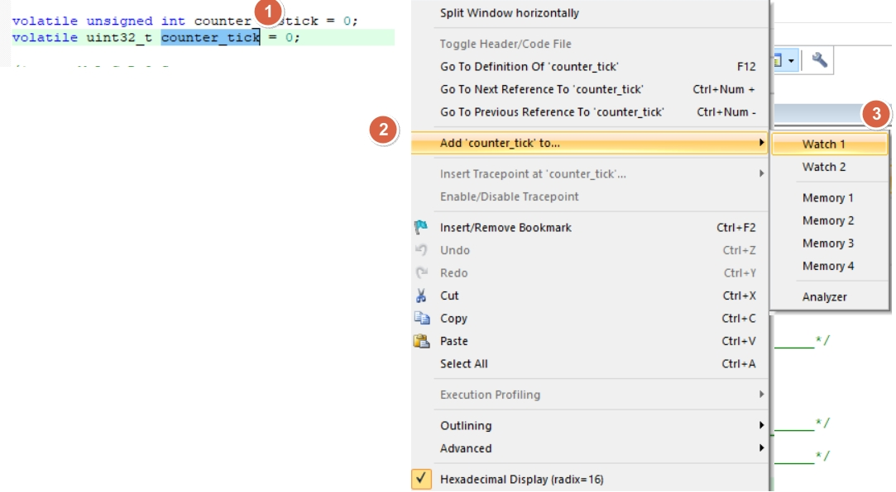

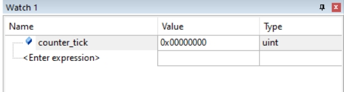

- press Run , to start code process

- will see the value change in real time 

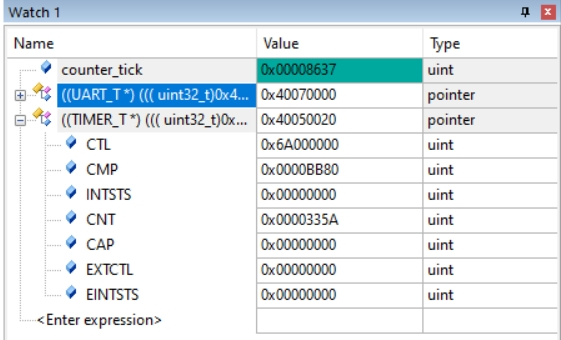

[back to top](#article_top)   

---

